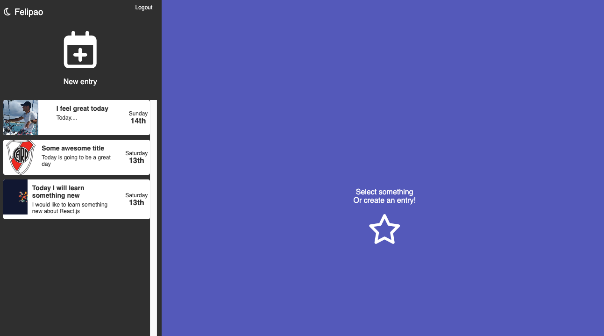

# React Journal App

A React app for Journal

## Description

A React app for Journal

## Getting Started

### Dependencies

- `npm`
- `node`

### Installing

- Clone the repository and install dependencies:

```
git clone https://github.com/Felipe-Navas/react-journal-app.git && cd react-journal-app && npm install
```

- Create a `.env.development` file in the root of the project and configure the following:
  - Add the content of ".env.development.example" into your new ".env.development" file
    - `REACT_APP_APIKEY`: In this variable add the API KEY of your app of firebase
    - `REACT_APP_AUTHDOMAIN`: In this variable add the AUTH DOMAIN of your app of firebase
    - `REACT_APP_PROJECTID`: In this variable add the PROJECT ID of your app of firebase
    - `REACT_APP_STORAGEBUCKET`: In this variable add the STORAGE BUCKET of your app of firebase
    - `REACT_APP_MESSAGINGSENDERID`: In this variable add the MESSAGING SENDER ID of your app of firebase
    - `REACT_APP_APPID`: In this variable add the APP ID of your app of firebase

### Executing program

```
npm start
```

Preview of the login screen:


Preview of the main screen:



Preview of the new entry screen:


### Running tests

```
npm test
```

Preview of the console after running the tests:


## Authors

- [Felipe Navas](https://www.linkedin.com/in/felipenavaslederhos) - [Email](mailto:felipenavas.itec@gmail.com?subject=[GitHub]%react-journal-app)

## Contributing

1. Fork it (<https://github.com/Felipe-Navas/react-journal-app/fork>)
2. Create your feature branch (`git checkout -b feature/fooBar`)
3. Commit your changes (`git commit -am 'Add some fooBar'`)
4. Push to the branch (`git push origin feature/fooBar`)
5. Create a new Pull Request

## License

This project is licensed under the [MIT License] - see the LICENSE file for details
